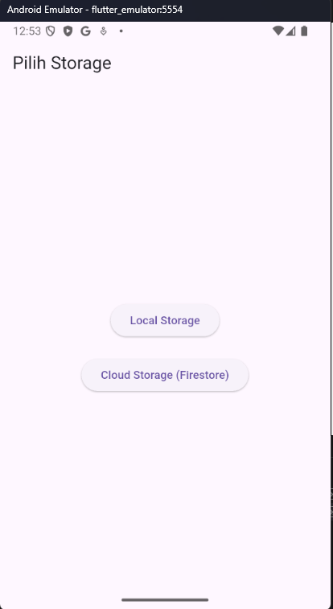
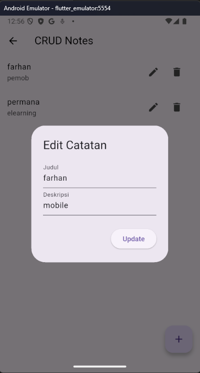
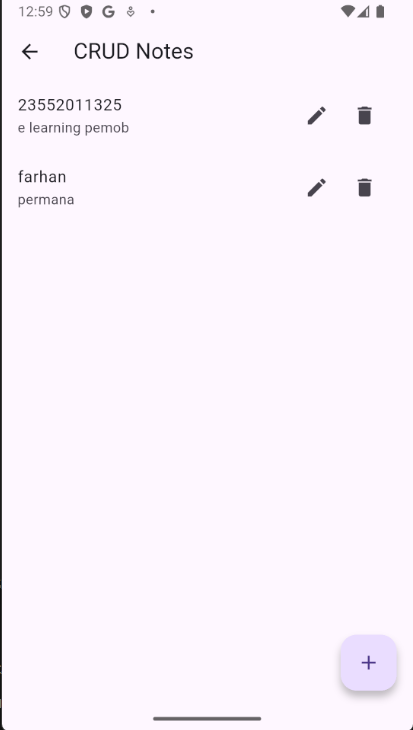
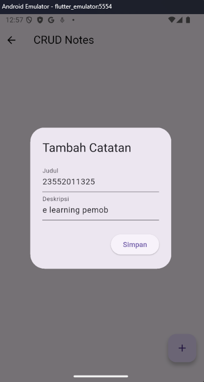
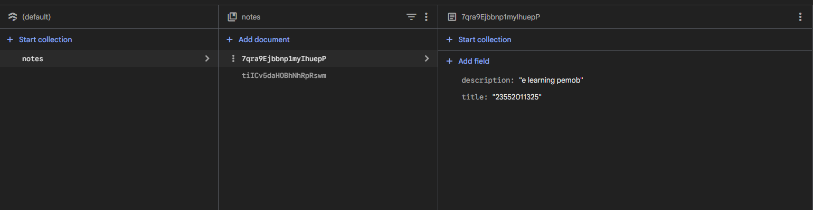

# Flutter CRUD Storage Option

Aplikasi Flutter CRUD sederhana dengan pilihan penyimpanan:
- Local Storage (SharedPreferences)
- Cloud Storage (Firebase Firestore)

## 🚀 Fitur
- Create, Read, Update, Delete (CRUD)
- Pilih jenis storage (Local / Cloud)
- Satu UI untuk dua sumber data
- Firebase Firestore integration

## 📱 Screenshot Aplikasi
### Pilih Storage

### CRUD Local

### CRUD Cloud

